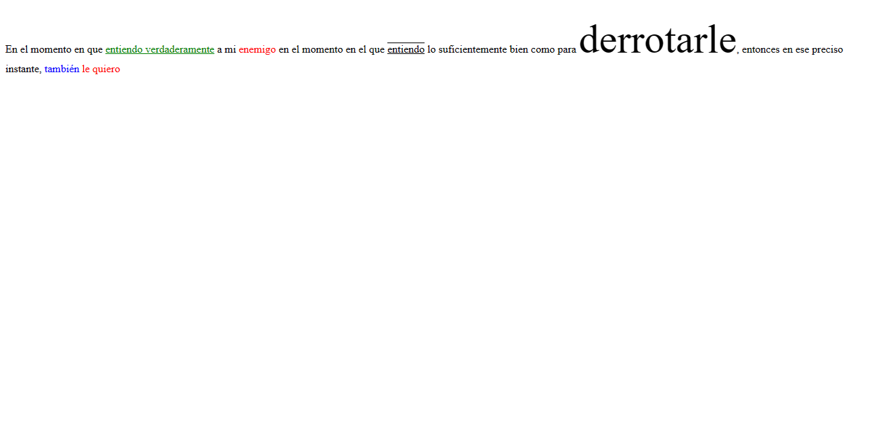
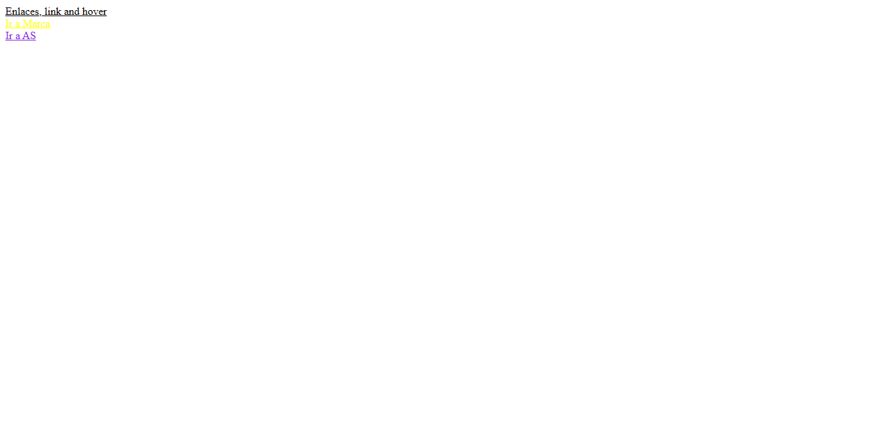
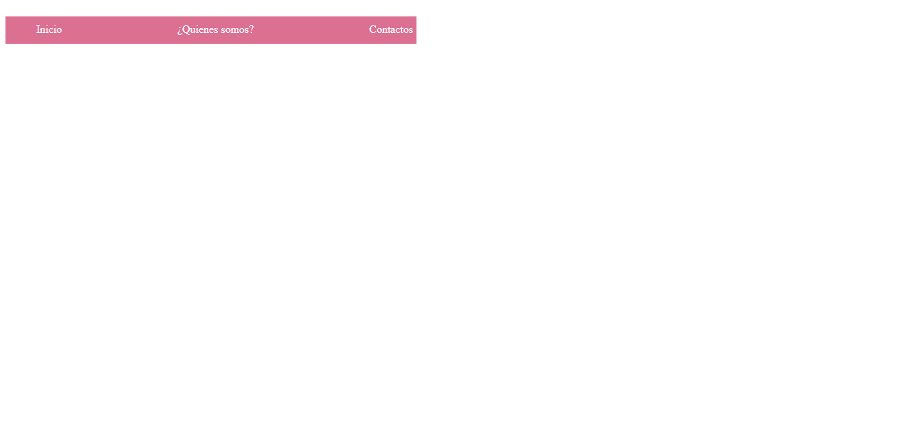
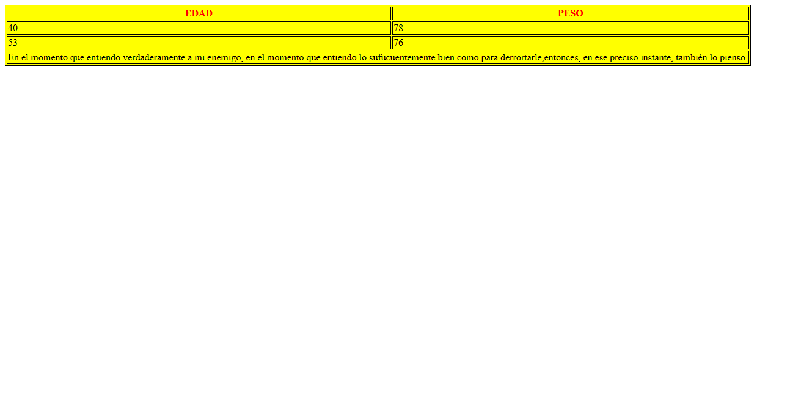

<h1>Taller 9 JUAN NICOLÁS BARBOSA PARDO</h1>

<h2> Información</h2>

Curso: full Stack Basico - Grupo 1

Profesor: Cristian Patiño

<h3>Link Página Web</h3>
<a href="https://nico012699bp.github.io/Taller-9-full-stack./" target="_black">Link Página Web</a>
<h2> Punto 1: Link figma</h2>

<a href="https://www.figma.com/file/cC2dw33TpQrjyxtfEJtU6z/Nicol%C3%A1s-Barbosa-Pardo---Figma-Exercise?type=design&node-id=0%3A1&mode=design&t=cQSgBOZyaeP7YgCW-1" target="_blank">Link de Figma</a>
<h2>Punto 2: HTML</h2>

<h2>Punto 3: CSS </h2>

<h2>Punto 4: </h2>

<h2>Punto 5</h2>

<h2>Punto 6</h2>

<h2>Punto 7-8</h2>

<h2>Punto 9</h2>

